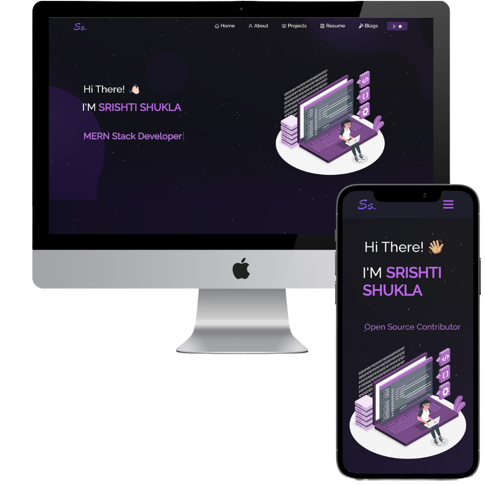

<h2 align="center">
  Portfolio Website 
  <a href="https://srishtishukla.netlify.app/" target="_blank">srishtishukla.netlify.app</a>
</h2>

  

 

<h3 align="center">
    🔹
    <a href="https://github.com/Srishti2128/Portfolio/issues">Report Bug</a> &nbsp; &nbsp;
    🔹
    <a href="https://github.com/Srishti2128/Portfolio/issues">Request Feature</a>
</h3>

You can fork this repo to modify and make changes of your own. Please give me proper credit by linking back to [Srishti2128](https://github.com/Srishti2128/Portfolio/). Thanks!

## Built With

My personal portfolio <a href="https://srishtishukla.netlify.app/" target="_blank">srishtishukla.netlify.app</a> which features some of my github projects as well as my resume and technical skills. 

This project was built using these technologies.

- React.js
- Node.js
- Express.js
- CSS3
- VsCode
- Netlify

## Features

**📖 Multi-Page Layout**

**🎨 Styled with React-Bootstrap and Css with easy to customize colors**

**📱 Fully Responsive**
